# Marelles_直棋对战游戏

### 背景描述

Marelles，中文名九子棋、直棋，是一款双人对战的益智棋盘类游戏，最早可追溯至罗马帝国时期。因其棋盘、棋子布置简单、可玩性高，是一款比较流行的游戏。

### 游戏规则

游戏棋盘由24个格点组成，棋盘如下图所示。两名玩家分别执黑、白，最初各有九个棋子，称为”士兵“。玩家通过移动”士兵“形成”军队“（即连续的三个棋子连成一条水平或竖直的直线）时，可以拿掉对方的一个棋子。当某一方玩家只剩两名“士兵”，或者玩家剩余的士兵不能移动时，则失败。


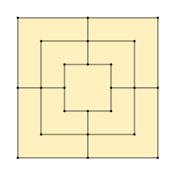

游戏共分为三个阶段：

1. 棋子放置阶段：棋盘起初为空。两名玩家决定谁先开始，轮流在空闲的格点处放置棋子。在放置过程中，如果有一方形成了连续的水平或竖直的三个棋子（称为“三连”），则可以从对方已放置的棋子中移除一个到游戏外。移除时，必须先移除没有形成一行或一列的棋子。双方轮流放置直到都放置过了九枚棋子。
2. 棋子移动阶段：玩家交替进行棋子移动。棋子移动时只能将自己一方的一枚棋子移动到相邻的空闲的格点处。如果移动棋子使得自己一方形成了一个“三连”，则该玩家需要立即选择对方玩家任意一枚棋子移出游戏。当某方玩家只剩三枚棋子时，进入第三阶段。
3. 棋子跳跃阶段：当某方玩家只剩三枚棋子时，他可以不受“每次移动只能选择相邻空闲位置”的限制，而可以将自己的任意一枚棋子移动到任意空闲格点。当某方玩家只剩两枚棋子时，该玩家失败。

### 程序设计原理

* 游戏界面设计：使用Java Swing组件进行GUI开发，游戏可以分为主页面、棋盘面板、状态面板、游戏进程面板等区域。当点击“玩家信息”、“游戏帮助”等按钮时，将会弹出提示窗口。
* 游戏进程进行：使用stepState模型来保存每个玩家每一步的信息，当落子、吃子时将修改模型内容，当游戏结束时会将模型内容保存至数据库中。
* 玩家信息管理：使用MySQL作为数据库管理玩家信息。当玩家进入棋盘所在页面时，需要输入昵称。如果昵称未被使用过则自动新建用户。
* 多人游戏模式：使用socket作为双人对战的基础。多人对战时MarellesServer默认预留20个连接槽，当玩家请求创建房间时，游戏服务器为其分配一个Handler。当玩家请求连接时，游戏服务器也为其分配一个Handler并将其与目标游戏房间建立关联，以实现数据通信。

### 程序设计目的

综合利用socket、GUI设计、数据库等所学知识，尝试使用设计模式，实现一款双人对战游戏。

### 程序算法说明

#### 游戏行为控制

##### 点击棋盘完成下棋

首先为鼠标注册回调函数。此处进行判断，当点击位置处于允许落子格点周围的圆形区域时，这一点击行为才会判定成为有效点击，并激发trigger函数。

```java
    private void register(MouseEvent e, int eventCode){
        int x = e.getX();
        int y = e.getY();
        boolean found = false;
        for (int i = 1 ; i <= 7 && !found; i++){
            if (Math.abs(i*edge-x) > edge) continue;
            for (int j = 1; j <= 7 && !found; j++){
                if (Math.abs(j*edge-y) > edge) continue;
                if (((x-edge*i)*(x-edge*i)+(y-edge*j)*(y-edge*j)) < (edge*edge/4)){
                    found = true;
                    int validation = stepState.localClick(i,j);
                    if (validation < ConstantDataSet.chessPostionMap.length)
                        trigger(validation,eventCode);
                }
            }
        }
    }
```

trigger函数中首先判断当前是否允许落子，其次判断是否处于自己移除对方棋子的状态。最后根据游戏的不同阶段来判断应该执行何种操作。

```java
    private void trigger(int index, int action){
        if (wait) {
            GameProcess.sendGameInfo("请等待对方落子！");
            return;
        }
        int resultCode;
        if (remove && action == CLICK && stepState.getPhase()!= StepState.PHASE6){
            resultCode = playBoard.removeChess(index);
            if (resultCode == ConstantDataSet.ERROR_EMPTY_CHESS){
                GameProcess.sendGameInfo("该位置没有棋子！");
                return;
            } else if (resultCode == ConstantDataSet.ERROR_SELF_CHESS){
                GameProcess.sendGameInfo("不能移除自己的棋子！");
                return;
            } else if (resultCode == ConstantDataSet.STATE_REMOVE_OK){
                GameProcess.sendGameInfo(new int[]{index},"已移除对方一枚棋子<1>");
                situation[index] = Chess.NONE;
                hasRemoveNum++;
                affect = index;
                stepState.popStep();
                stepState.addStep(from,to,index,Chess.BLACK);
                updateState();
                return;
            }
        }
        int phase = stepState.getPhase();

        if (action == CLICK) {
            if (phase == StepState.PHASE1) {
                placeBlackChess(index);
            } else if (phase == StepState.PHASE2 || phase == StepState.PHASE3) {
                moveBlackChess(index);
            } else if (phase == StepState.PHASE4 || phase == StepState.PHASE5) {
                jumpBlackChess(index);
            } else if (phase == StepState.PHASE6) {
                gameOver(index);
            }
        }
    }
```

##### 放置阶段

当游戏处于放置阶段时，玩家可以在自己的回合内放置一枚棋子。

```java
    private void placeBlackChess(int index){
        int resultCode = playBoard.placeChess(index, Chess.BLACK);
        if (resultCode == ConstantDataSet.ERROR_OVERLAP){
            playBoard.selectChess(index);
        } else if (resultCode == ConstantDataSet.STATE_PLACE_OK){
            situation[index] = Chess.BLACK;
            from = index;
            to = index;
            GameProcess.sendGameInfo(new int[]{index},"你在<1>放置了一枚棋子");
            stepState.addStep(index,index,index,Chess.BLACK);
            updateState();
        }
    }
```

##### 移动阶段

当游戏处于移动阶段时，玩家可以在自己的回合内将自己的一枚棋子移动到相邻的空格处

```java
    private void moveBlackChess(int index){
        int resultCode = playBoard.checkChessColor(index);
        if (resultCode == Chess.BLACK){
            playBoard.selectChess(index);
            from = index;
        } else if (resultCode == Chess.BLACK_SELECTED) {
            playBoard.selectChess(index);
            from = -1;
        } else if (resultCode == Chess.NONE){
            if (from != -1){
                int ans = playBoard.moveChess(from,index);
                switch (ans){
                    case ConstantDataSet.ERROR_OVERLAP:
                        GameProcess.sendGameInfo("该位置已有棋子！");
                        break;
                    case ConstantDataSet.ERROR_EMPTY_CHESS:
                        GameProcess.sendGameInfo("棋子已被移动！");
                        break;
                    case ConstantDataSet.ERROR_TOO_FAR:
                        GameProcess.sendGameInfo("只能相邻移动！");
                        break;
                    case ConstantDataSet.STATE_UNKOWN:
                        GameProcess.sendGameInfo("未知错误");
                        break;
                    case ConstantDataSet.STATE_MOVE_OK:
                        situation[from] = Chess.NONE;
                        situation[index] = Chess.BLACK;
                        to = index;
                        stepState.addStep(from,index,index,Chess.BLACK);
                        GameProcess.sendGameInfo(new int[]{from,index},"你将棋子从<1>移动到<2>");
                        updateState();
                }
            }
        }
    }
```

##### 跳跃阶段

当游戏处于跳跃阶段时，玩家可以在自己的回合内将自己的棋子移动到任意一处空位。

```java
    private void jumpBlackChess(int index){
        int resultCode = playBoard.checkChessColor(index);
        if (resultCode == Chess.BLACK){
            playBoard.selectChess(index);
            from = index;
        } else if (resultCode == Chess.BLACK_SELECTED) {
            playBoard.selectChess(index);
            from = -1;
        } else if (resultCode == Chess.NONE){
            if (from != -1){
                int ans = playBoard.jumpChess(from,index);
                switch (ans){
                    case ConstantDataSet.ERROR_OVERLAP:
                        GameProcess.sendGameInfo("该位置已有棋子！");
                        break;
                    case ConstantDataSet.ERROR_EMPTY_CHESS:
                        GameProcess.sendGameInfo("棋子已被移动！");
                        break;
                    case ConstantDataSet.STATE_UNKOWN:
                        GameProcess.sendGameInfo("未知错误");
                        break;
                    case ConstantDataSet.STATE_JUMP_OK:
                        situation[from] = Chess.NONE;
                        situation[index] = Chess.BLACK;
                        to = index;
                        stepState.addStep(from,index,index,Chess.BLACK);
                        GameProcess.sendGameInfo(new int[]{from,index},"你将棋子从<1>跳跃到<2>");
                        updateState();
                }
            }
        }
    }
```

##### 单人模式下AI的行为模式

放置阶段，以阻止玩家三连为首要目标，以自己达成三连为次要目标，如果均不能满足则随机放置棋子。

```java
    private int AIPlaceChess(int selfColor, int oppoColor){
        for(int i = 0; i < situation.length; i++){
            int tempColor = situation[i];
            if (tempColor == Chess.NONE) {
                situation[i] = oppoColor;
                if (AIcheckThree(oppoColor)){
                    situation[i] = tempColor;
                    return i;
                }
                situation[i] = tempColor;
            }
        }
        for(int i = 0; i < situation.length; i++){
            int tempColor = situation[i];
            if (tempColor == Chess.NONE) {
                situation[i] = selfColor;
                if (AIcheckThree(selfColor)){
                    situation[i] = tempColor;
                    return i;
                }
                situation[i] = tempColor;
            }
        }
        return getRandomPlace(Chess.NONE);
    }
```


#### socket通信处理

##### 对战连接

使用`[options]`作为连接阶段的控制字符，当server检测到信息传递以`[`作为字符串开头时，将会把这一信息作为连接建立命令来处理。命令解释：

`[host]` 表示玩家创建房间，其后跟玩家昵称（同时也作为房间名）

`[guest]`表示玩家准备加入房间，其后跟玩家昵称（同时作为客体名称）

`[find-host]`表示玩家申请加入房间，其后跟目标房间名称

`[oppo-name]`表示玩家已经成功加入房间，其后跟玩家名称。这一信息将发送至房主并通知有玩家加入房间

```java
    public static int setUpConnections(String info, int from) throws IOException {
        if (info.startsWith("[host]")) clientName[from] = info.substring(6);
        else if (info.startsWith("[guest]")) clientName[from] = info.substring(7);
        else if (info.startsWith("[find-host]")) {
            String target = info.substring(11);
            for (int i = 0; i < MAX_SIZE; i++){
                if (handlers[i] == null) continue;
                if (clientName[i] == null) continue;
                if (clientName[i].equals(target) && aliveState[i]){
                    System.out.println(clientName[from]+"已与"+clientName[i]+"建立连接");
                    handlers[i].setOppoNumber(from);
                    sendMessageTo(i,"[oppo-name]"+clientName[from]);
                    return i;
                }
            }
        }
        return -1;
    }

    private void handle(InputStream input, OutputStream output) throws IOException {
        selfWriter = new BufferedWriter(new OutputStreamWriter(output, StandardCharsets.UTF_8));
        selfReader = new BufferedReader(new InputStreamReader(input, StandardCharsets.UTF_8));
        selfWriter.write("Successfully connected to server. Current ID is "+ selfNumber +"\n");
        selfWriter.flush();
        while (true){
            String s = selfReader.readLine();
            System.out.println(s);
            if (s.startsWith("[")) {
                oppoNumber = MarellesServer.setUpConnections(s, selfNumber);
                MarellesServer.sendMessageTo(selfNumber,s);
            } else {
                MarellesServer.sendMessageTo(oppoNumber,s);
            }
        }
    }
```

##### 落子通讯

使用`wait|`和`nowait|`开头的控制格式进行游戏步骤的通讯，标准格式为`wait|from|to|affect` 或`nowait|from|to|affect`，用以通知对方玩家的行动，此后随之更新自己的棋盘信息。由于游戏特点“满足三连后移除对方棋子”，这一步骤是连续的，而时间是分开计算，所以需要先进行棋子移动，再进行棋子移除。以下是格式说明：

* `wait`: 消息发送方移动后形成三连，消息接受方需要等待新的信息才能落子
* `nowait`: 消息发送方移动后没有形成三连，消息接受方可以进行操作
* `from|to|affect`：分别表示消息发送方所移动的棋子的初始位置、结束位置、产生的影响

##### 悔棋与逃跑控制

若游戏未结束而一方玩家点击悔棋或结束游戏时，将向另外一方发送悔棋或结束游戏的消息。这一控制消息以`control`开头。

* 当悔棋时，发送`control|undo`，当另一方玩家收到悔棋消息时，双方棋盘均更新。
* 当结束游戏（即逃跑）时，发送`control|runAway`，当另一方玩家收到逃跑消息时，将获胜。

### 程序流程框图

#### 程序整体流程框图

系统程序整体部分流程框图如下

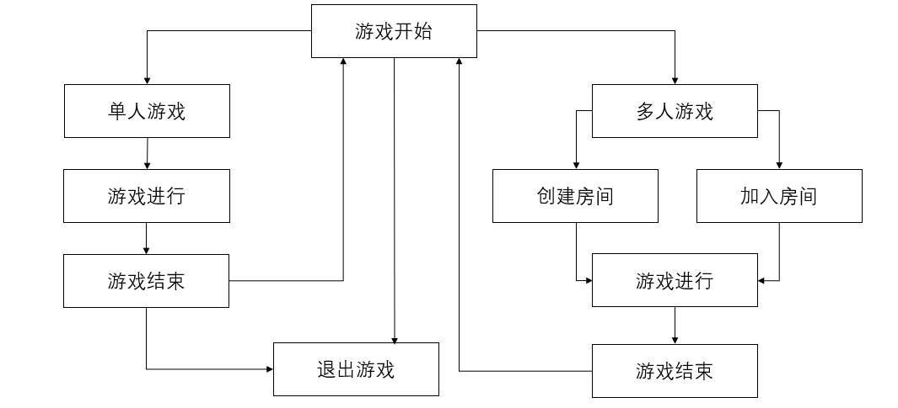

#### 单人游戏流程框图

单人游戏时程序流程框图如下

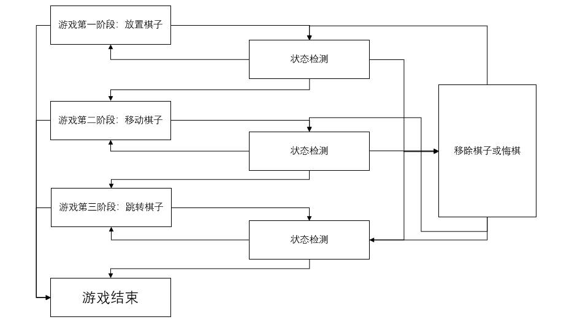

#### 多人游戏流程框图

多人游戏和单人游戏相比增加了消息同步模块

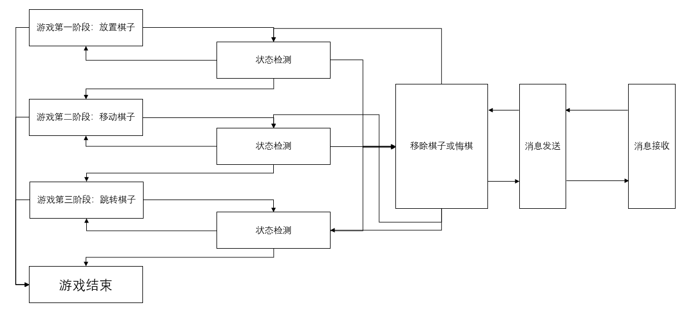

### 调用函数关系

#### 鼠标监听

游戏主要通过鼠标点击进行。鼠标点击函数调用图如下

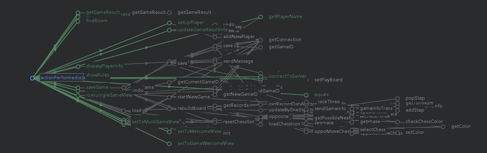

#### 程序整体函数调用关系

从图中大致可以看出，各模块间函数具有一定的独立性

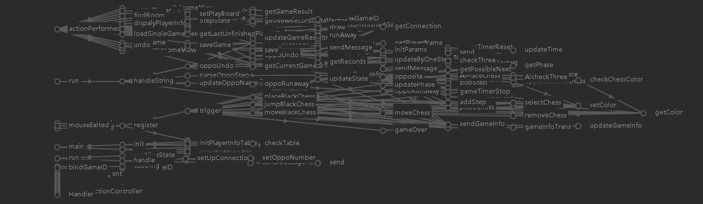

#### 客户端主程序函数调用关系

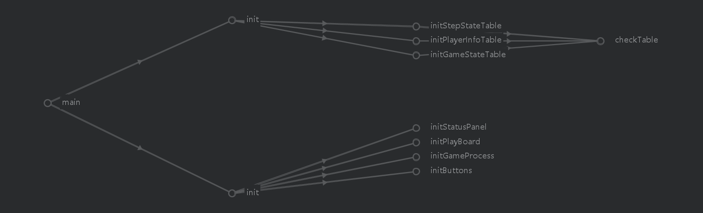

#### 游戏界面绘制函数调用关系

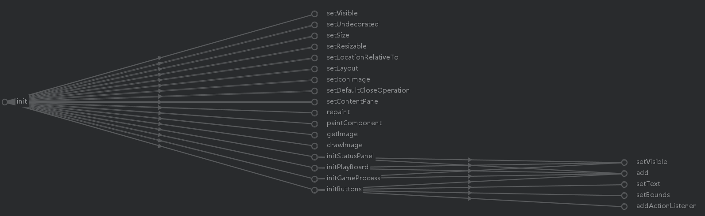

### 文件列表

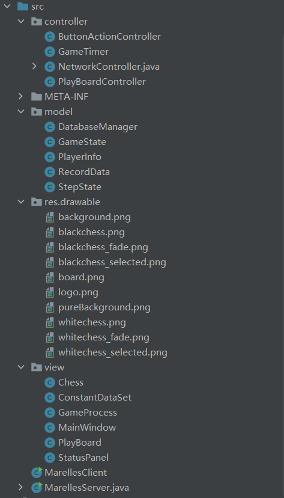

```
─src
   │  MarellesClient.java
   │  MarellesServer.java
   │
   ├─controller
   │      ButtonActionController.java
   │      GameTimer.java
   │      NetworkController.java
   │      PlayBoardController.java
   │
   │
   ├─model
   │      DatabaseManager.java
   │      GameState.java
   │      PlayerInfo.java
   │      RecordData.java
   │      StepState.java
   │
   ├─res
   │  └─drawable
   │          background.png
   │          blackchess.png
   │          blackchess_fade.png
   │          blackchess_selected.png
   │          board.png
   │          logo.png
   │          pureBackground.png
   │          whitechess.png
   │          whitechess_fade.png
   │          whitechess_selected.png
   │
   └─view
           Chess.java
           ConstantDataSet.java
           GameProcess.java
           MainWindow.java
           PlayBoard.java
           StatusPanel.java
```

### 设计模式

* 采用MVC的结构，将棋盘显示、棋局控制、数据控制三方面分离开来
* 采用单例模式，为数据库连接创建单例类，降低资源消耗
* 采用解释器模式，动态解析游戏进程栏提交的游戏进程文本
* 采用备忘录模式，为大部分类提供良好的封装性，并为外部访问提供了内部状态信息
* 采用状态模式，为游戏进程设定六种状态

### 难点、要点、得意点

* 完成了复杂的游戏功能设计
* 实现了消息的动态解析，包括网络信息的两种模式：确认连接与下棋信息传递
* 综合使用了Swing、Socket、Database等多种知识
* 使用ConstantDataSet类保存游戏需要用到的全局变量，易于修改
* 使用MVC架构，将视图层、模型层、控制层进行分离，易于维护

### 程序使用说明

#### 编译环境

* IDE

  ```
  IntelliJ IDEA 2020.2.3 (Ultimate Edition)
  Build #IU-202.7660.26, built on October 6, 2020
  Licensed to Boyu Chang
  Subscription is active until December 26, 2021
  For educational use only.
  Runtime version: 11.0.8+10-b944.34 amd64
  VM: OpenJDK 64-Bit Server VM by JetBrains s.r.o.
  Windows 10 10.0
  GC: ParNew, ConcurrentMarkSweep
  Memory: 1965M
  Cores: 8
  Registry: ide.suppress.double.click.handler=true
  Non-Bundled Plugins: Statistic, org.jetbrains.kotlin, com.intellij.plugins.html.instantEditing, com.jetbrains.php, Pythonid
  ```

* JAVA version 

  ```
  java version "1.8.0_271"
  Java(TM) SE Runtime Environment (build 1.8.0_271-b09)
  Java HotSpot(TM) 64-Bit Server VM (build 25.271-b09, mixed mode)
  ```

* OS

  ```
  Microsoft Window 10 家庭中文版
  基于x64的电脑
  ```

  #### 程序运行方法

1. 导入数据库驱动

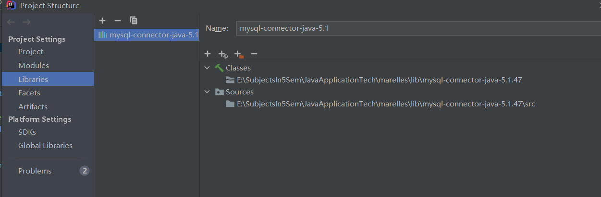

2. 开始游戏前需要启动MySQL服务

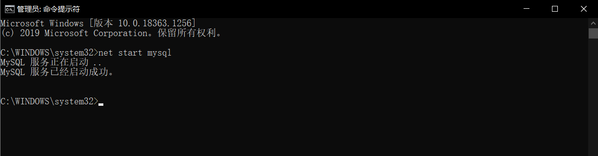

3. 如果是第一次进行游戏，需要手动创建marelles数据库，使用命令为`create database marelles`
4. 单人模式时直接新建游戏
5. 双人模式时需要启动marellesServer，由房主创建游戏后另一玩家加入游戏以开始

### 程序实例


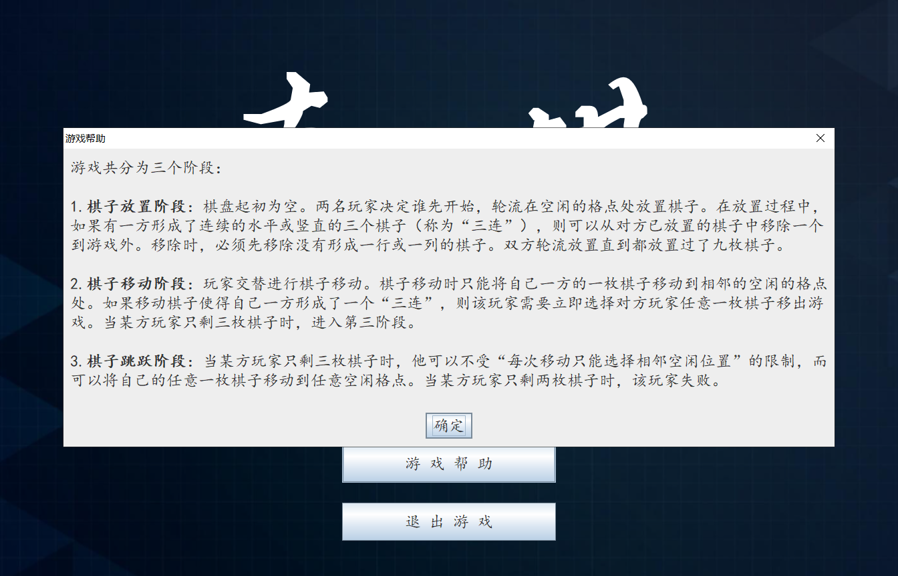


### 程序结果说明分析

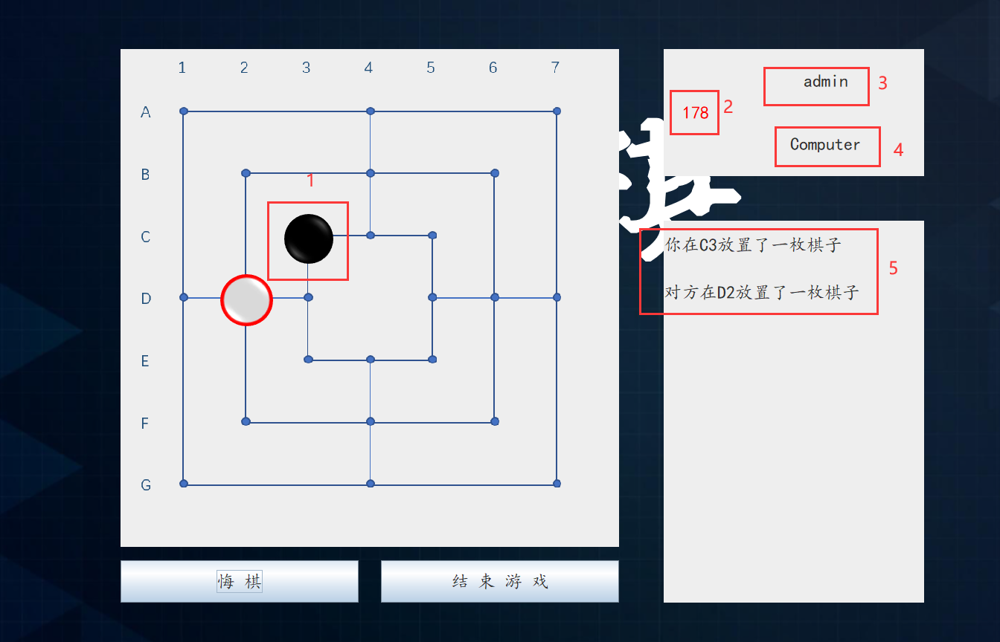

如图，1为落子位置，2显示倒计时，3显示玩家昵称，4表示对方是电脑，5展示游戏信息

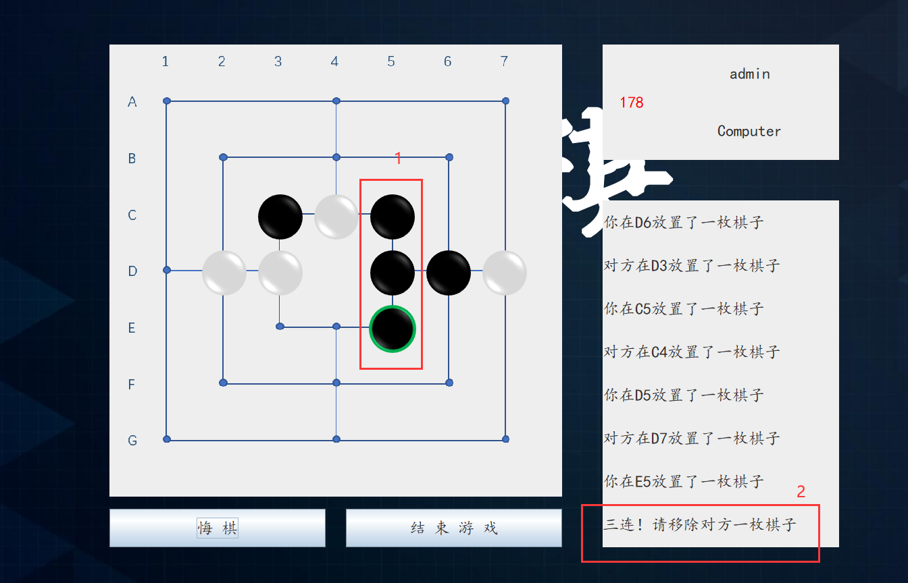

如图，1为自己的棋子形成三连，2处提示可以移除对方一枚棋子

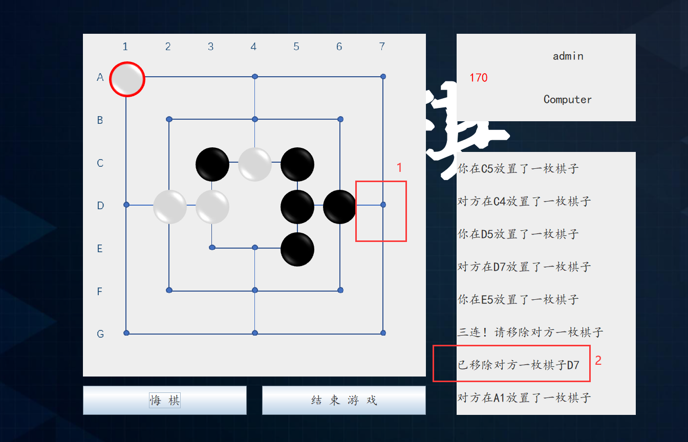

1选择对方D7棋子后，该棋子被移除，2同时显示游戏信息

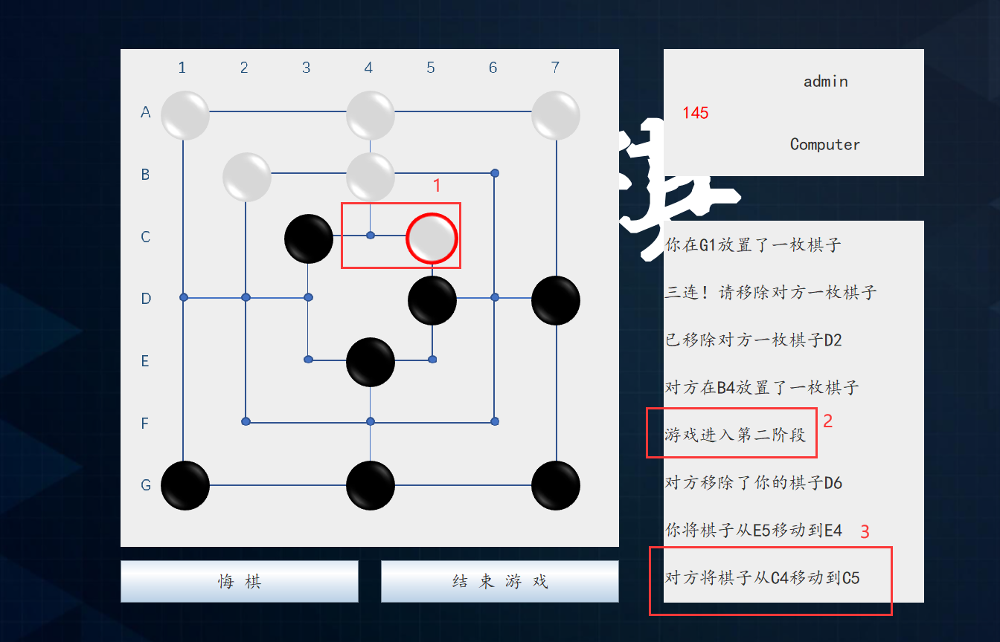

2游戏显示进入第二阶段，1对方移动棋子，3显示游戏信息

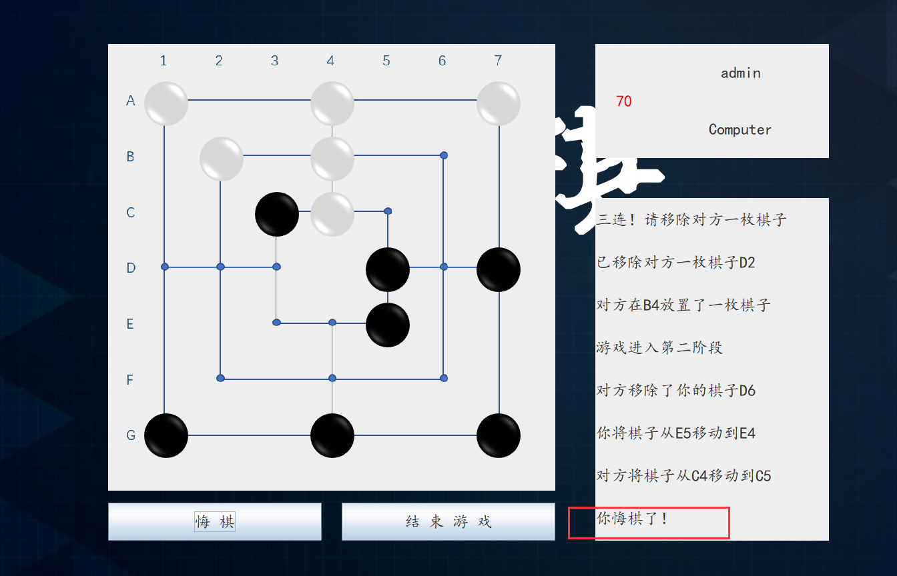

自己悔棋

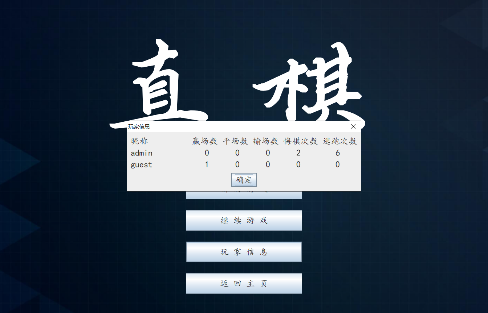

显示玩家信息


显示游戏帮助


### 总结与展望

本项目工程量可谓是非常大，综合使用了GUI、socket、database等JAVA知识，并尝试使用了一些设计模式。通过统计一共编写了2357行代码。在进行编程的时候也遇到了许多问题，通过搜索的方式一一解决。游戏遇到最大的困难就是设计游戏的各种规则本身。由于和五子棋、黑白棋等其他同类产品相比，直棋棋盘不规则、游戏规则复杂、下棋方式多变，因此需要在游戏的状态处理上十分小心，并经过大量的测试来发现各种意外情况。

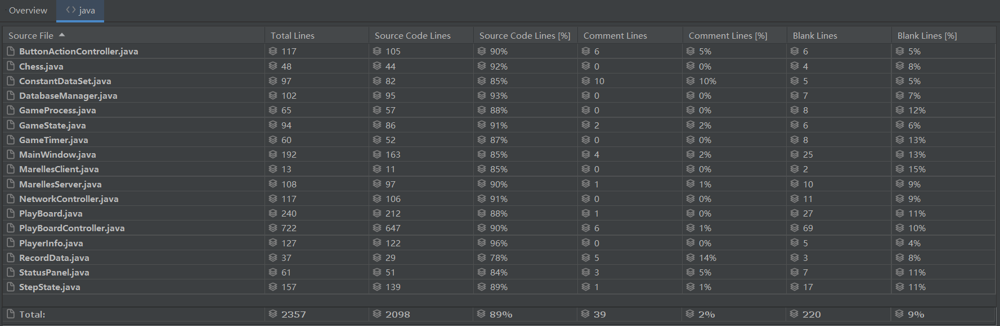

GUI方面：

* 使用JOptionPane.showMessageDialog弹出消息框，但是默认字体不方便阅读。解决方法是传入JLabel，通过设定JLabel的Font来修改字体。在进行文本换行的时候学习到JLabel在定义时传入的字符串可以以HTML的方式表示，使用`<br>`进行换行。

Database方面：

* 最初使用易于迁移的sqlite作为数据库，但由于其仅支持库级锁，粒度过大，且几乎不支持并发操作，因此最后决定使用mysql作为数据库。和sqlite相比，mysql支持细粒度锁、并发编程，且报错信息详细，更加健壮。

Socket方面：

* 最初运行时出现卡死的情况，经检查是因为发送的字符串没有以'\n'作为结尾，导致readline函数阻塞程序。

游戏设计方面：

* 检查三连时需要保存该三连是否是新生成的，否则三连后所有操作都会被认为是三连
* AI检查棋局时的三连不需要更改三连检查记录
* 判负判断不能简单根据指定颜色做循环，还需要对“没有该颜色”和“该颜色周围无路可走但仍可放置”进行特殊判断处理
* 敌手的第二、第三阶段和自己的第二、第三阶段未必同步。所以对于游戏实现来说需要分为六个阶段
