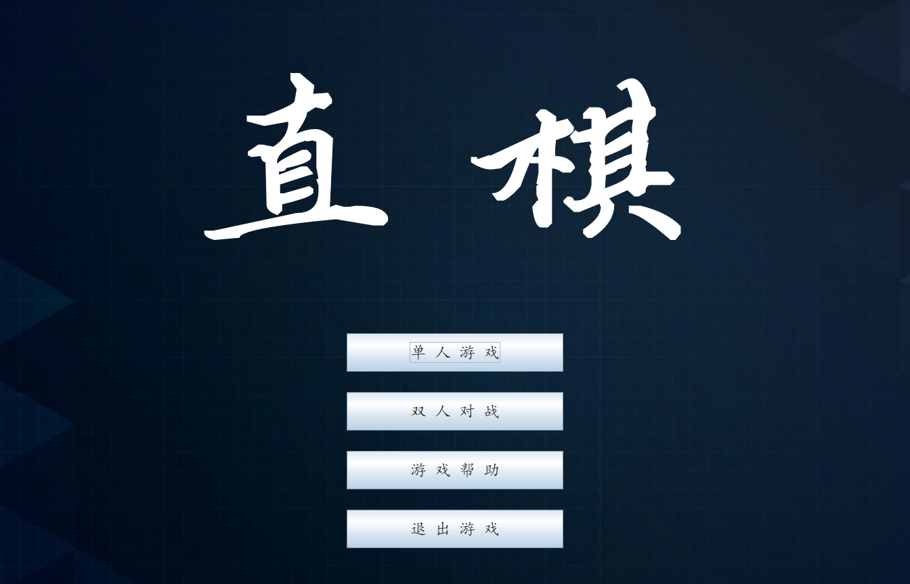
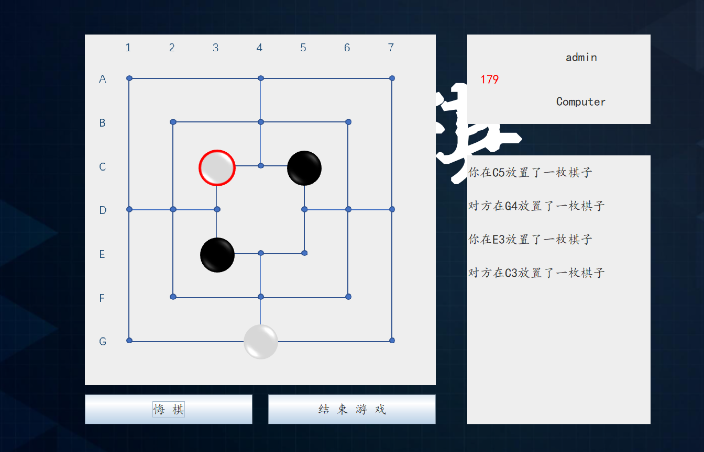

[TOC]


# Marelles_直棋对战游戏


### 背景描述

Marelles，中文名九子棋、直棋，是一款双人对战的益智棋盘类游戏，最早可追溯至罗马帝国时期。因其棋盘、棋子布置简单、可玩性高，是一款比较流行的游戏。本次期末大程以这款游戏为核心元素，结合socket、GUI、数据库等知识，实现了双人在线对战游戏。

### 游戏规则

游戏棋盘由24个格点组成，棋盘如下图所示。两名玩家分别执黑、白，最初各有九个棋子，称为”士兵“。玩家通过移动”士兵“形成”军队“（即连续的三个棋子连成一条水平或竖直的直线）时，可以拿掉对方的一个棋子。当某一方玩家只剩两名“士兵”，或者玩家剩余的士兵不能移动时，则失败。


游戏共分为三个阶段：

1. 棋子放置阶段：棋盘起初为空。两名玩家决定谁先开始，轮流在空闲的格点处放置棋子。在放置过程中，如果有一方形成了连续的水平或竖直的三个棋子（称为“三连”），则可以从对方已放置的棋子中移除一个到游戏外。移除时，必须先移除没有形成一行或一列的棋子。双方轮流放置直到都放置过了九枚棋子。
2. 棋子移动阶段：玩家交替进行棋子移动。棋子移动时只能将自己一方的一枚棋子移动到相邻的空闲的格点处。如果移动棋子使得自己一方形成了一个“三连”，则该玩家需要立即选择对方玩家任意一枚棋子移出游戏。当某方玩家只剩三枚棋子时，进入第三阶段。
3. 棋子跳跃阶段：当某方玩家只剩三枚棋子时，他可以不受“每次移动只能选择相邻空闲位置”的限制，而可以将自己的任意一枚棋子移动到任意空闲格点。当某方玩家只剩两枚棋子时，该玩家失败。

### 程序设计原理

### 程序设计目的

### 程序算法说明

### 程序流程框图

### 调用函数关系

### 文件列表

```
─src
   │  MarellesClient.java
   │  MarellesServer.java
   │
   ├─controller
   │      ButtonActionController.java
   │      GameTimer.java
   │      NetworkController.java
   │      PlayBoardController.java
   │
   │
   ├─model
   │      DatabaseManager.java
   │      GameState.java
   │      PlayerInfo.java
   │      RecordData.java
   │      StepState.java
   │
   ├─res
   │  └─drawable
   │          background.png
   │          blackchess.png
   │          blackchess_fade.png
   │          blackchess_selected.png
   │          board.png
   │          logo.png
   │          pureBackground.png
   │          whitechess.png
   │          whitechess_fade.png
   │          whitechess_selected.png
   │
   └─view
           Chess.java
           ConstantDataSet.java
           GameProcess.java
           MainWindow.java
           PlayBoard.java
           StatusPanel.java
```


### 设计模式

### 难点、要点、得意点

### 程序使用说明

#### 编译环境

* IDE

  ```
  IntelliJ IDEA 2020.2.3 (Ultimate Edition)
  Build #IU-202.7660.26, built on October 6, 2020
  Licensed to Boyu Chang
  Subscription is active until December 26, 2021
  For educational use only.
  Runtime version: 11.0.8+10-b944.34 amd64
  VM: OpenJDK 64-Bit Server VM by JetBrains s.r.o.
  Windows 10 10.0
  GC: ParNew, ConcurrentMarkSweep
  Memory: 1965M
  Cores: 8
  Registry: ide.suppress.double.click.handler=true
  Non-Bundled Plugins: Statistic, org.jetbrains.kotlin, com.intellij.plugins.html.instantEditing, com.jetbrains.php, Pythonid
  ```

* JAVA version 

  ```
  java version "1.8.0_271"
  Java(TM) SE Runtime Environment (build 1.8.0_271-b09)
  Java HotSpot(TM) 64-Bit Server VM (build 25.271-b09, mixed mode)
  ```

* OS

  ```
  Microsoft Window 10 家庭中文版
  基于x64的电脑
  ```

  #### 程序运行方法

1. 导入数据库驱动


2. 单人模式时直接新建游戏
3. 双人模式时需要启动服务器，由房主创建游戏后另一玩家加入游戏以开始

### 程序实例






### 程序结果说明分析

### 结论展望


### 设计要点、创新点


### 主要文件及目录说明

```python
./
|-
```


### 实验心得

本次实验工程量可谓是非常大，综合使用了GUI、socket、database等JAVA知识，并尝试使用了一些设计模式。在进行编程的时候也遇到了许多问题，通过搜索的方式一一解决。

GUI方面：

* 使用JOptionPane.showMessageDialog弹出消息框，但是默认字体不方便阅读。解决方法是传入JLabel，通过设定JLabel的Font来修改字体。在进行文本换行的时候学习到JLabel在定义时传入的字符串可以以HTML的方式表示，使用`<br>`进行换行。

Database方面：

* 最初使用易于迁移的sqlite作为数据库，但由于其仅支持库级锁，粒度过大，且几乎不支持并发操作，因此最后决定使用mysql作为数据库。和sqlite相比，mysql支持细粒度锁、并发编程，且报错信息详细，更加健壮。

Socket方面：

* 